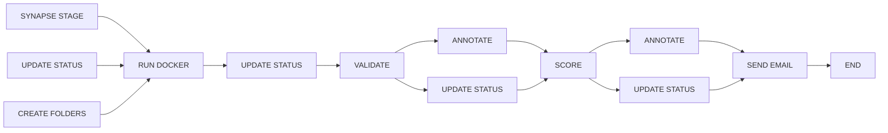
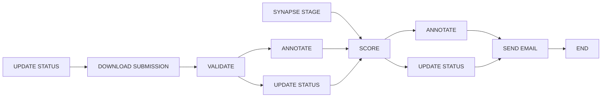

# nf-synapse-challenge

A general purpose Nextflow workflow for evaluating submissions to challenges hosted on Synapse.

## Overview

This repository is structured so that each challenge type has its own subworkflow which is wrapped by a uniquely named workflow in `main.nf`. This allows users to invoke the workflow appropriate for their challenge by using the `entry` parameter locally:
```
nextflow run main.nf -entry {subworkflow_name} -profile local
```
or on Nextflow Tower by using the `Workflow entry name` field under `Advanced options`.

## Setup

This workflow expects a secret called `SYNAPSE_AUTH_TOKEN` (a Synapse Authentication Token). This secret should be configured in your local installation of Nextflow for local runs, or as a workspace secret in your Nextflow Tower workspace. Ensure that the token you use has access to any Synapse views and folders that you intend to use as inputs to the workflow.

**Note:** All default parameter values for Synapse project or objects (`view_id` and `input_id`) currently point to a Synapse project that only DPE team members have access to. Unless you have access to the `DPE-Testing` Synapse project, you will not be able to test this workflow with the default values using your `SYNAPSE_AUTH_TOKEN`.

## Supported Challenge Types

- [Model-to-Data](#model-to-data-challenges)
- [Data-to-Model](#data-to-model-challenges)

## Submission Inputs

Each of the supported challenge workflows can take inputs providing the submissions to evaluate including:

1. `submissions` (optional): A comma separated list of submission IDs to evaluate.

Example: `9741046,9741047`

1. `manifest` (optional): A path to a submission manifest containing submission IDs to evaluate.

Example:  

  ```CSV
  submission_id
  9741046
  9741047
  ```

## Model-to-Data Challenges

### Prerequisites

In order to use this workflow, you must already have completed the following steps:

1. Created a Synapse project shared with challenge participants.
1. Created an evaluation queue within the Synapse project.
1. One or more Docker images have already been submitted to your evaluation queue.
1. Created a submission view that includes the `id` and `status` columns.
1. Added the input data for evaluating submissions to a folder within your Synapse project.

### Running the workflow

The workflow takes the following inputs:

***Note:*** You must provide one of `submissions` or `manifest`. If you provide both, `submissions` will take precedence. Generally, `submissions` should be used for testing and `manifest` for automation.

1. `submissions` (required if `manifest` is not provided): A comma separated list of submission IDs to evaluate.
1. `manifest` (required if `submissions` is not provided): A path to a submission manifest containing submissions IDs to evaluate.
1. `project_name` (required & case-sensitive): The name of your Project the Challenge is running in. Please replace placeholder value.
1. `view_id` (required): The Synapse ID for your submission view. Please replace placeholder value.
1. `input_id` (required): The Synapse ID for the folder holding the testing data for submissions. Please replace placeholder value.
1. `email_with_score` (optional & case-sensitive): Choose whether or not the e-mail sent out to participants will include the evaluation score or not. Can either be "yes" or "no". Defaults to "yes".
1. `cpus` (optional): Number of CPUs to dedicate to the `RUN_DOCKER` process i.e. the challenge executions. Defaults to `4`
1. `memory` (optional): Amount of memory to dedicate to the `RUN_DOCKER` process i.e. the challenge executions. Defaults to `16.GB`
1. `scoring_script` (optional): The string name of the scoring script to use for the `SCORE` step of the workflow run. Defaults to `model_to_data_score.py`
1. `validation_script` (optional): The string name of the validation script to use for the `VALIDATE` step of the workflow run. Defaults to `validate.py`


Run the workflow locally with default inputs and a `submissions` string input:
```
nextflow run main.nf -entry MODEL_TO_DATA_CHALLENGE -profile local --submissions 9741046,9741047
```

With a `manifest` input:
```
nextflow run main.nf -entry DATA_TO_MODEL_CHALLENGE -profile local --manifest assets/model_to_data_submission_manifest.csv
```

### Workflow DAG




## Data-to-Model Challenges

### Prerequisites

In order to use this workflow, you must already have completed the following steps:

1. Created a Synapse project shared with challenge participants.
1. Created an evaluation queue within the Synapse project.
1. One or more data files have already been submitted to your evaluation queue.
1. Created a submission view that includes the `id` and `status` columns.

### Running the workflow

The workflow requires the following inputs:

***Note:*** You must provide one of `submissions` or `manifest`. If you provide both, `submissions` will take precedence. Generally, `submissions` should be used for testing and `manifest` for automation.

1. `submissions` (required if `manifest` is not provided): A comma separated lis tof submission IDs to evaluate.
1. `manifest` (required if `submissions` is not provided): A path to a submission manifest containing submissions IDs to evaluate.
1. `view_id` (required): The Synapse ID for your submission view.
1. `scoring_script` (required): The string name of the scoring script to use for the `SCORE` step of the workflow run. Defaults to `data_to_model_score.py`
1. `validation_script` (required): The string name of the validation script to use for the `VALIDATE` step of the workflow run. Defaults to `validate.py`
1. `testing_data` (required): The Synapse ID for the folder holding the testing data for submissions.
1. `email_with_score` (optional & case-sensitive): Choose whether or not the e-mail sent out to participants will include the evaluation score or not. Can either be "yes" or "no". Defaults to "yes".


Run the workflow locally with default inputs and a `submissions` string input:
```
nextflow run main.nf -entry DATA_TO_MODEL_CHALLENGE -profile local --submissions 9741046,9741047
```

With a `manifest` input:
```
nextflow run main.nf -entry DATA_TO_MODEL_CHALLENGE -profile local --manifest assets/data_to_model_submission_manifest.csv
```

### Workflow DAG



## Profiles

The workflow includes two preconfigured `profiles` for memory and CPU allocation for the `RUN_DOCKER` step of Model-to-Data challenges. The `local` profile includes `cpus` = `4` and `memory` = `16.GB`. This is intended to be used for runs on local machines with adequate resources. The `tower` profile dedicates double the resources (`cpus` = `8`; `memory` = `32.GB`) and can be used when running the workflow on Nextflow Tower for improved performance.

## Adding Support for New Challenge Types

### Adding a New Subworkflow

If you would like to add support for a new challenge type, you can do so by creating a new subworkflow in the `subworkflows` directory. Name your subworkflow clearly with the name of the new challenge type. You should try to use the existing library of modules to build your subworkflow. It is important to not change the logic of existing modules to avoid breaking other subworkflows. Rather, you should add new process definitions to the `modules` folder and give them clear names that indicate their purpose. Once you have created your subworkflow, you can add it to the `main.nf` file and test it using:
```
nextflow run main.nf -entry {your_new_subworkflow_name}
```

### Adding New Scoring and Validation Scripts

If you would like to contribute new scoring or validation scripts, you can do so by giving your scripts a descriptive name such as `my_challenge_scoring.py` and adding them to the `bin` directory. You can then pass the name of your new scripts to the workflow using the `scoring_script` and `validation_script` parameters. The workflow will then use them in the appropriate steps.
