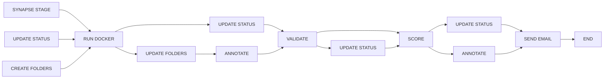
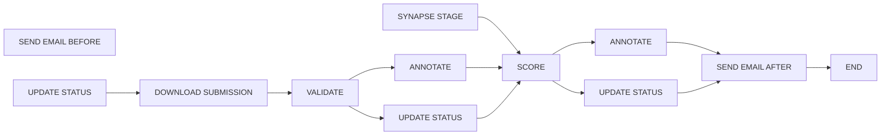

# nf-synapse-challenge

A general purpose Nextflow workflow for evaluating submissions to challenges hosted on Synapse.

## Overview

This repository is structured so that each challenge type has its own subworkflow which is wrapped by a uniquely named workflow in `main.nf`. This allows users to invoke the workflow appropriate for their challenge by using the `entry` parameter locally:
```
nextflow run main.nf -entry {subworkflow_name} -profile local
```
or on Nextflow Tower by using the `Workflow entry name` field under `Advanced options`.

## Setup

This workflow expects a secret called `SYNAPSE_AUTH_TOKEN` (a Synapse Authentication Token). This secret should be configured in your local installation of Nextflow for local runs, or as a workspace secret in your Nextflow Tower workspace. Ensure that the token you use has access to any Synapse views and folders that you intend to use as inputs to the workflow.

**Note:** All default parameter values for Synapse project or objects (e.g. `view_id`, `data_folder_id`) currently point to a Synapse project that only DPE team members have access to. Unless you have access to the `DPE-Testing` Synapse project, you will not be able to test this workflow with the default values using your `SYNAPSE_AUTH_TOKEN`.

## Supported Challenge Types

- [Model-to-Data](#model-to-data-challenges)
- [Data-to-Model](#data-to-model-challenges)

## Submission Inputs

Each of the supported challenge workflows can take inputs providing the submissions to evaluate including:

1. `submissions` (optional): A comma separated list of submission IDs to evaluate.

Example: `9741046,9741047`

1. `manifest` (optional): A path to a submission manifest containing submission IDs to evaluate.

Example:  

  ```CSV
  submission_id
  9741046
  9741047
  ```

## Model-to-Data Challenges

### TLDR

The `MODEL_TO_DATA.nf` workflow works with all model-to-data medical Challenges hosted at Sage, but its parameters need to be customized in order to work with your particular Challenge. Please use the following steps to get started:

1. Complete the pre-requesites listed under [Prerequisites for Model to Data](#Prerequisites-for-Model-to-Data).
2. Create a pull request with your Challenge profile added to `nextflow.config` (see [Configuring the Model to Data Workflow](#Configuring-the-Model-to-Data-workflow) for further instructions).
3. The maintainers of this repository will work with you to ensure your container is integrated with the model-to-data workflow and the parameters provided in step 2 are valid.
4. Test the profile by making a submission to the evaluation queue represented by the given `params.view_id`. The reviewer will manually run the model-to-data workflow to ensure this new submission is picked up and processed appropriately.
5. If the workflow is successful, the pull request can be merged and automation will be configured in the backend.

### Introduction

The `MODEL_TO_DATA.nf` workflow is designed to handle model-to-data Challenge formats by asynchronously running containers for Docker image submissions, evaluating the results using the provided scoring and validation scripts, updating the Synapse project with output files, and sharing the evaluation results with users via e-mail and submissions annotations. This repository can work in conjunction with [orca-recipes](https://github.com/Sage-Bionetworks-Workflows/orca-recipes) to enable scheduled workflow execution according to your desired cadence. Please see below for a DAG outlining the processes executed in the `MODEL_TO_DATA.nf` workflow, pre-requisites for running the workflow, and how you can tailor this workflow to your specific model-to-data Challenge requirements by adding your own config profile(s) in `nextflow.config`.

### Workflow DAG



### Prerequisites for Model to Data

In order to use this workflow, you must already have completed the following steps:

1. Created a Synapse project shared with challenge participants.
1. Created an evaluation queue within the Synapse project.
1. One or more Docker images have already been submitted to your evaluation queue.
1. Created a submission view that includes the `id` and `status` columns.
1. Added the input data for evaluating submissions to a folder within your Synapse project.
1. Added the goldstandard file to your Synapse project.
1. Created a repository, based off [this template repository](https://github.com/Sage-Bionetworks-Challenges/orca-evaluation-templates), that houses the validation and scoring scripts to be used for evaluation.
1. Published said repository to the GitHub Container Registry (GHCR) and ensured it is visible to the public.

If you are new to containerization and/or the GHCR, [see here](https://docs.github.com/en/packages/working-with-a-github-packages-registry/working-with-the-container-registry) for how to create and publish your own container on the GHCR.

### Configuring the Model to Data workflow

Before the model-to-data workflow can run, it must be configured for a given Challenge. Challenge organizers are required to update the `nextflow.config` file with a config profile for their custom parameters to be picked up in the workflow run. [See here](https://www.nextflow.io/docs/latest/config.html#config-profiles) for more information on Nextflow config profiles and their uses. The requested profile should use the following format:

```
my_challenge {
    params.view_id = "syn123"
    params.data_folder_id = "syn456"
    params.project_name = "My Project (Write it as it appears on Synapse!)"
    params.goldstandard_id = "syn789"
  }
```

Where the parameters are denoted by `params.[parameter_name]`. Below is the list of available parameters for configuring the `MODEL_TO_DATA.nf` workflow to a particular model-to-data Challenge. Keep in mind that most are optional, but some are required, and the workflow will not be able to run until they are provided.

> [!warning]
> Before modifying the input parameters, there are some things to consider...
> * You must provide one of `submissions` or `manifest`. If you provide both, `submissions` will take precedence. Generally, `submissions` should be used for testing and `manifest` for automation.
> * Your input scoring and validation scripts should each take in 3 arguments: the predictions file, the gold standard file, and the output file name. The scripts will be called upon in the following format:
> ```
> [interpreter] [script_name] -p [predictions_file] -g [gold_standard_folder] -o [output_file]
> ```
> Python Example:
> ```
> python3 validate.py -p "predictions.csv" -g "gold_standard_folder/" -o "results.json"
> ```
> R Example:
> ```
> Rscript validate.R -p "predictions.csv" -g "gold_standard_folder/" -o "results.json"
> ```
> Ensure that your scripts can be called in this way without issue.

1. `submissions` (required if `manifest` is not provided): A comma separated list of submission IDs to evaluate.
1. `manifest` (required if `submissions` is not provided): A path to a submission manifest containing submissions IDs to evaluate.
1. `project_name` (required & case-sensitive): The name of your Project the Challenge is running in. Please replace placeholder value.
1. `view_id` (required): The Synapse ID for your submission view. Please replace placeholder value.
1. `data_folder_id` (required): The Synapse ID for the folder holding the testing or validation data for submissions. Please replace placeholder value.
1. `goldstandard_id` (required): The Synapse ID for the gold standard file that will be used for evaluating the submissions. Please replace placeholder value.
1. `email_with_score` (optional & case-sensitive): Choose whether or not the e-mail sent out to participants will include the evaluation score or not. Can either be "yes" or "no". Defaults to "yes".
1. `cpus` (optional): Number of CPUs to dedicate to the `RUN_DOCKER` process i.e. the challenge executions. Defaults to `4`.
1. `memory` (optional): Amount of memory to dedicate to the `RUN_DOCKER` process i.e. the challenge executions. Defaults to `16.GB`.
1. `challenge_container` (optional): The name of the container that the scoring and validation scripts are housed in, and will be executed in, during the validation and scoring steps of the workflow. Defaults to `ghcr.io/jaymedina/test_model2data:latest`.
1. `execute_scoring` (optional): This string should be `[interpreter] [path to script]` e.g. `python3 path/to/score.py`. This is the command that will be used to execute the scoring script for the `SCORE` step of the workflow run (without the arguments, which are appended later). Keep in mind this will execute at the base of your repository, so if the file is in the base directory, just use the file name. Defaults to `python3 /usr/local/bin/score.py`.
1. `execute_validation` (optional): This string should be `[interpreter] [path to script]` e.g. `python3 path/to/validate.py`. This is the command that will be used to execute the validation script for the `VALIDATE` step of the workflow run (without the arguments, which are appended later). Keep in mind this will execute at the base of your repository, so if the file is in the base directory, just use the file name. Defaults to `python3 /usr/local/bin/validate.py`.
1. `send_email` (optional): If `true`, sends an e-mail to the submitter on the status of their submission. Default is `true`.
1. `email_script` (required if `send_email` is `true`): If `send_email` is `true`, choose an e-mail template to send to submitters on the status of their submission. Default is a generic `send_email.py` template.
1. `private_folders` (optional & case-sensitive): Choose which folder(s), if any, should be set to private (i.e. only available to Challenge organizers). Must be a comma-separated string of folder names, e.g. "predictions,docker_logs".
1. `log_max_size` (optional): The maximum size of the Docker execution log (in kilobytes). Defaults to 50 kb.

### Running the workflow

Run the workflow locally with default inputs and a `submissions` string input:
```
nextflow run main.nf -entry MODEL_TO_DATA_CHALLENGE -profile local --submissions 9741046,9741047
```

With a `manifest` input:
```
nextflow run main.nf -entry DATA_TO_MODEL_CHALLENGE -profile local --manifest assets/model_to_data_submission_manifest.csv
```


## Data-to-Model Challenges

### TLDR

The `DATA_TO_MODEL.nf` workflow works with all data-to-model medical Challenges hosted at Sage, but its parameters need to be customized in order to work with your particular Challenge. Please use the following steps to get started:

1. Complete the pre-requesites listed under [Prerequisites for Data to Model](#Prerequisites-for-Data-to-Model).
2. Create a pull request with your Challenge profile added to `nextflow.config` (see [Configuring the Data to Model Workflow](#Configuring-the-Data-to-Model-workflow) for further instructions).
3. The maintainers of this repository will work with you to ensure your container is integrated with the model-to-data workflow and the parameters provided in step 2 are valid.
4. Test the profile by making a submission to the evaluation queue represented by the given `params.view_id`. The reviewer will manually run the model-to-data workflow to ensure this new submission is picked up and processed appropriately.
5. If the workflow is successful, the pull request can be merged and automation will be configured in the backend.

### Introduction

The `DATA_TO_MODEL.nf` workflow is designed to handle data-to-model Challenge formats by asynchronously running submissions, evaluating the results using the provided scoring and validation scripts, updating the Synapse project with output files, and sharing the evaluation results with users via e-mail and submissions annotations. This repository can work in conjunction with [orca-recipes](https://github.com/Sage-Bionetworks-Workflows/orca-recipes) to enable scheduled workflow execution according to your desired cadence. Please see below for a DAG outlining the processes executed in the `DATA_TO_MODEL.nf` workflow, pre-requisites for running the workflow, and how you can tailor this workflow to your specific data-to-model Challenge requirements by adding your own config profile(s) in `nextflow.config`.

### Prerequisites for Data to Model

In order to use this workflow, you must already have completed the following steps:

1. Created a Synapse project shared with challenge participants.
1. Created an evaluation queue within the Synapse project.
1. One or more data files have already been submitted to your evaluation queue.
1. Created a submission view that includes the `id` and `status` columns.

### Configuring the Data to Model workflow

Before the data-to-model workflow can run, it must be configured for a given Challenge. Challenge organizers are required to update the `nextflow.config` file with a config profile for their custom parameters to be picked up in the workflow run. [See here](https://www.nextflow.io/docs/latest/config.html#config-profiles) for more information on Nextflow config profiles and their uses. The requested profile should use the following format:

```
my_challenge {
    params.view_id = "syn123"
    params.testing_data = "syn456"
  }
```

Where the parameters are denoted by `params.[parameter_name]`. Below is the list of available parameters for configuring the `DATA_TO_MODEL.nf` workflow to a particular data-to-model Challenge. Keep in mind that most are optional, but some are required, and the workflow will not be able to run until they are provided.

> [!warning]
> Before modifying the input parameters, there are some things to consider... <br>
> You must provide one of `submissions` or `manifest`. If you provide both, `submissions` will take precedence. Generally, `submissions` should be used for testing and `manifest` for automation.

1. `submissions` (required if `manifest` is not provided): A comma separated lis tof submission IDs to evaluate.
1. `manifest` (required if `submissions` is not provided): A path to a submission manifest containing submissions IDs to evaluate.
1. `view_id` (required): The Synapse ID for your submission view.
1. `scoring_script` (required): The string name of the scoring script to use for the `SCORE` step of the workflow run. Defaults to `data_to_model_score.py`.
1. `validation_script` (required): The string name of the validation script to use for the `VALIDATE` step of the workflow run. Defaults to `validate.py`.
1. `testing_data` (required): The Synapse ID for the folder holding the testing data for submissions.
1. `email_with_score` (optional & case-sensitive): Choose whether or not the e-mail sent out to participants will include the evaluation score or not. Can either be "yes" or "no". Defaults to "yes".
1. `send_email` (optional): If `true`, sends an e-mail to the submitter on the status of their submission. Default is `true`.
1. `email_script` (required if `send_email` is `true`): If `send_email` is `true`, choose an e-mail template to send to submitters on the status of their submission. Default is a generic `send_email.py` template.

### Running the workflow

Run the workflow locally with default inputs and a `submissions` string input:
```
nextflow run main.nf -entry DATA_TO_MODEL_CHALLENGE -profile local --submissions 9741046,9741047
```

With a `manifest` input:
```
nextflow run main.nf -entry DATA_TO_MODEL_CHALLENGE -profile local --manifest assets/data_to_model_submission_manifest.csv
```

### Workflow DAG



## Adding Support for New Challenge Types

### Adding a New Subworkflow

If you would like to add support for a new challenge type, you can do so by creating a new subworkflow in the `subworkflows` directory. Name your subworkflow clearly with the name of the new challenge type. You should try to use the existing library of modules to build your subworkflow. It is important to not change the logic of existing modules to avoid breaking other subworkflows. Rather, you should add new process definitions to the `modules` folder and give them clear names that indicate their purpose. Once you have created your subworkflow, you can add it to the `main.nf` file and test it using:
```
nextflow run main.nf -entry {your_new_subworkflow_name}
```

### Adding New Scoring and Validation Scripts

If you would like to contribute new scoring or validation scripts, you can do so by giving your scripts a descriptive name such as `my_challenge_scoring.py` and adding them to the `bin` directory. You can then pass the name of your new scripts to the workflow using the `scoring_script` and `validation_script` parameters. The workflow will then use them in the appropriate steps.
